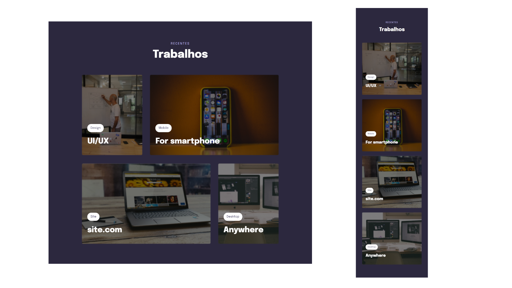

  

## 🖥️ Projeto
Nesse projeto foi desenvolvido um exemplo de portfolio para aprender os conceitos de css como grid, filter, clamp, transform, transition, animation, @keyframes, @media queries, espaçamentos e fontes responsivas além de começar pela versão mobile (mobile first) e como o layout vai se comportando em diferentes telas.

## 🚀 Tecnologias
Foi desenvolvido esse projeto no programa Explorer da Rocketseat no stage 02.

- HTML
- CSS
- GIT
- GITHUB
- FIGMA

## 👁 View
Aqui você pode visualizar o layout do projeto
<a 
  href="https://www.figma.com/file/oVXcHpAVuSmt1TVN4WPiHf/Explorer-Stage-03-Projeto-03-(Copy)?type=design&node-id=203-1865&t=OoZJdq7xjmT0aCna-0" target="_blank">clique aqui</a>
